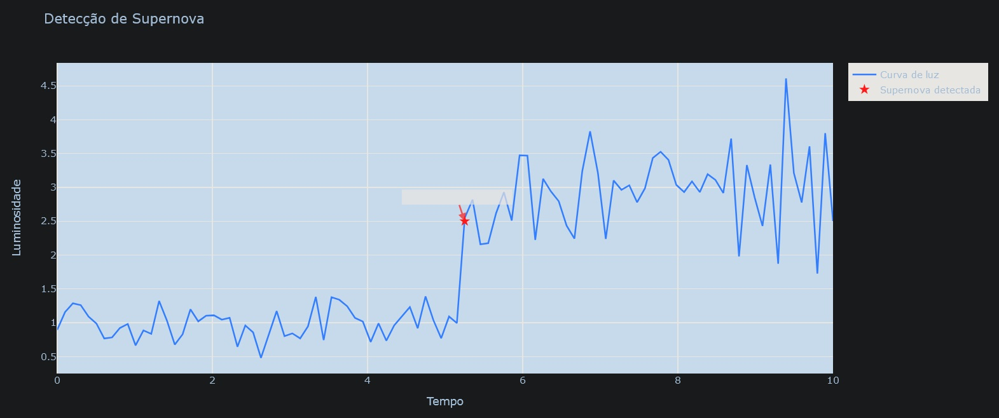

# Simulador de Detecção de Supernova

Este programa é um simulador que gera uma curva de luz aleatória representando a luminosidade de uma estrela ao longo do tempo. O objetivo principal é simular a detecção de uma supernova, um evento astronômico em que uma estrela atinge um brilho extremamente alto antes de entrar em colapso.

## Como Funciona

### Geração da Curva de Luz

O programa utiliza a biblioteca Plotly e a linguagem de programação Python para criar uma curva de luz. A função `curva_de_luz` gera uma curva aleatória usando uma distribuição normal para a luminosidade da estrela ao longo do tempo. Além disso, uma supernova é simulada adicionando um aumento repentino na luminosidade em um ponto aleatório da curva.

```python
# Geração da curva de luz aleatória com uma supernova simulada
def curva_de_luz():
    tempo = np.linspace(0, 10, 100)
    luminosidade_base = np.random.normal(loc=1.0, scale=0.2, size=len(tempo))

    supernova_index = np.random.randint(20, 80)
    luminosidade_supernova = np.random.normal(loc=2.0, scale=0.5, size=len(tempo) - supernova_index)
    luminosidade = np.concatenate((luminosidade_base[:supernova_index], luminosidade_base[supernova_index:] + luminosidade_supernova))

    return tempo, luminosidade
```

### Detecção da Supernova

A função `detectar_supernova` verifica se há um aumento significativo na luminosidade indicando a presença de uma supernova. Isso é feito comparando a luminosidade em cada ponto com um threshold predefinido.

```python
# Detecção da supernova na curva de luz
def detectar_supernova(tempo, luminosidade):
    threshold = 1.5
    for i in range(len(tempo)):
        if luminosidade[i] > threshold:
            return True, tempo[i]

    return False, None
```

### Visualização Gráfica

A curva de luz gerada e a supernova simulada são então visualizadas em um gráfico interativo usando a biblioteca Plotly. O ponto onde a supernova foi detectada é destacado no gráfico.

```python
# Configuração do gráfico e exibição
def main():
    tempo, luminosidade = curva_de_luz()
    supernova_detectada, tempo_supernova = detectar_supernova(tempo, luminosidade)

    trace_curva_luz = go.Scatter(x=tempo, y=luminosidade, mode='lines', name='Curva de luz', line=dict(color='blue', width=2))
    trace_supernova = go.Scatter(x=[tempo_supernova], y=[2.5], mode='markers', name='Supernova detectada',
                                marker=dict(color='red', size=10, symbol='star'))

    layout = go.Layout(title='Detecção de Supernova', xaxis=dict(title='Tempo'), yaxis=dict(title='Luminosidade'))
    fig = go.Figure(data=[trace_curva_luz, trace_supernova], layout=layout)

    if supernova_detectada:
        fig.add_annotation(
            x=tempo_supernova,
            y=2.5,
            text="Supernova detectada!",
            showarrow=True,
            arrowhead=2,
            arrowsize=1,
            arrowwidth=2,
            arrowcolor="red",
            font=dict(size=12, color="black"),
            bgcolor="white",
            opacity=0.7
        )

    fig.update_layout(showlegend=True)
    fig.show()

if __name__ == "__main__":
    main()
```

### Plot gerado <br>




## Compreensão Astronômica

Este simulador é útil para estudar a detecção de supernovas e entender como os astrônomos analisam curvas de luz para identificar eventos astronômicos significativos. O aumento repentino na luminosidade é um indicativo crucial de uma supernova e pode fornecer informações valiosas sobre a evolução estelar.

Ao interagir com este simulador, os usuários podem explorar diferentes configurações e compreender os desafios associados à detecção de eventos raros em dados astronômicos. Isso contribui para a educação e o treinamento de estudantes e entusiastas interessados na astronomia.

### Autor <br>
[ Lauro Bonometti + ChatGPT ] <br>
[ lauro.f.bonometti@gmail.com] <br>